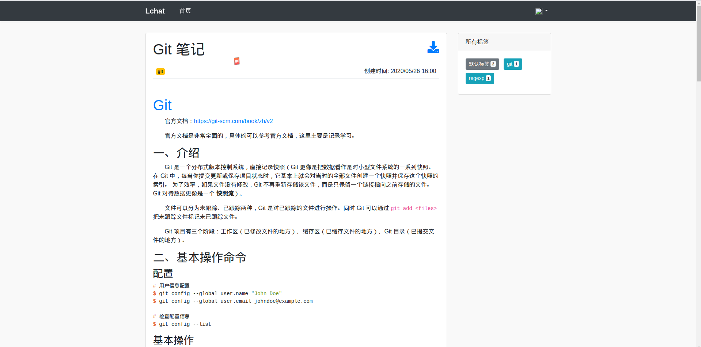

 # lchat
一个用 go 语言实现的 Web 小项目，博客类型


## 技术支持
**后端**
- gin (go web 框架)
- gorm (orm 框架)
- go-yarm (配置文件)
- go-uuid (唯一键)
**前端**
- bootstrap (ui)
- jquery (js)
- font-awesome (icon)
- simplemde (mardown)

## 功能说明
- 实现了用户注册（邮箱验证），登录（包括 Github 第三方登录）功能
- 实现了文章发布、添加文章标签、文章修改、文章浏览功能，支持文章下载

## 使用说明
**运行程序**
```console
$ ./chat
```
**配置文件**: conf/lchat.yaml
```console
$ cat conf/lchat.yaml
```
&emsp;&emsp;可以看到一个默认的用户邮箱: admin@163.com 和 密码: admin，配置邮箱相关可以实现注册用户时发送注册码邮件，配置 Github oauth 相关可以实现第三方 Github 登录

## 效果图

**首页**


**注册**


**登录**


**文章编辑**


**用户文库**


**浏览文章**



